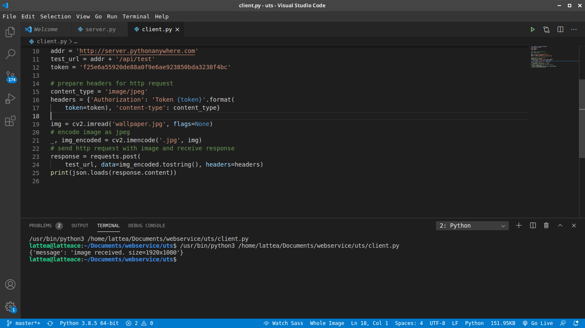

# SendReceiveImage-Flask

We use server.pythonanywhere.com/api/test as server

Working directory : /home/server/mysite
<strong>SetUp server :</strong>
- install opencv-python and other modules which will imported
- create token API

And we try to make a simple test using client.py
run it via terminal, but the code <em>won't display anythng on browser</em>
here is output :

Authors:
Ika Fadila
Nadya Putri Andryani

Tag : <em>Web Service</em>
<strong>Unisbank University</strong>
